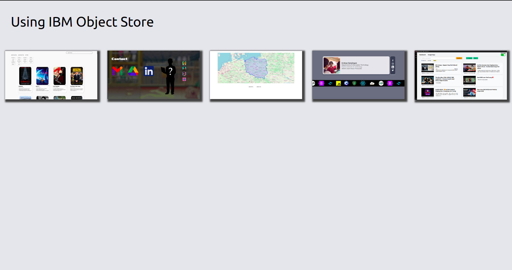
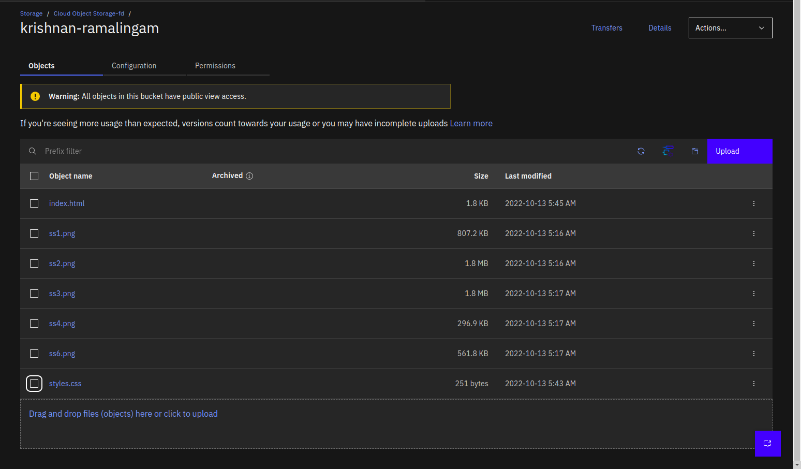
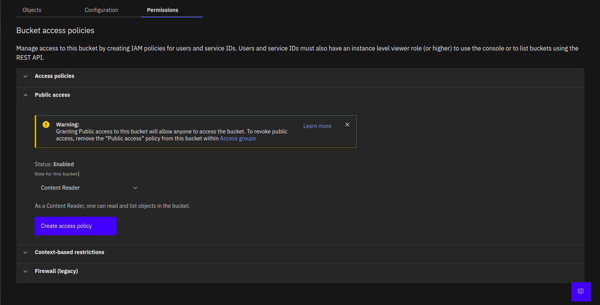

# Object Store Assignment

<figure>

 
<figcaption><i><b>Click Image to Open Link</b></i></figcaption>
</figure>

 

### <b>Screenshots</b>

<table>
	<thead>
		<td>
			<b>Uploaded Objects</b>
		</td>
		<td>
			<b>Access Controls</b>
		</td>
	</thead>
	<tr>
		<td>
            
		</td>
		<td>
            
		</td>
	</tr>
</table>
